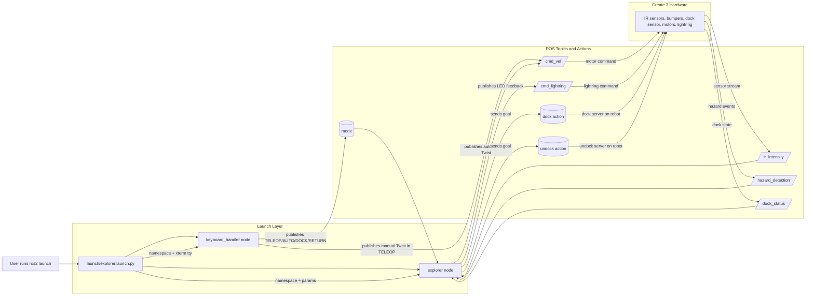

# Project-Groupe5 - Create 3 Autonomous Explorer

ROS 2 package for the **iRobot Create 3** providing autonomous exploration, reactive obstacle avoidance, and a timed mission return-to-dock behavior.

## Requirements

The project follows a **modular state machine** architecture coordinated by the ROS 2 Python node `explorer`, with manual override handled by `keyboard_handler`.

* **Framework**: Python 3 / ROS 2 Jazzy.
* **Runtime dependencies**: `ros-${ROS_DISTRO}-irobot-create-msgs` and `xterm`.
* **Persistence**: Uses a `saved_state` buffer so tasks resume correctly after a manual pause.

```bash
sudo apt update
sudo apt install ros-${ROS_DISTRO}-irobot-create-msgs
sudo apt install xterm
```

## System Specifications

* **Controller**: Dual-node ROS 2 architecture (`explorer` and `keyboard_handler`).
* **Sensors**: 7x IR intensity sensors, tactile bumper hazards, and docking status feedback.
* **Sampling**: IR readings at approximately 62 Hz.
* **Visual feedback**: 6-LED RGB light ring.

## Build & Install

**1. Clone the repository:**
```bash
cd ~/ros2_ws/src
git clone https://github.com/IM2AG-IntroRob2026/Project-Groupe5.git
```

**2. Build the package:**
```bash
cd ~/ros2_ws
colcon build --symlink-install --packages-select obstacle_avoidance
source install/setup.bash
```

## Run

To launch the autonomous behavior using a specific robot namespace (e.g., `Robot5`):

```bash
ros2 launch obstacle_avoidance explorer.launch.py namespace:=Robot5
```

If you prefer to run the executable directly, you can still use:

```bash
ros2 run obstacle_avoidance explorer --ros-args -r __ns:=/Robot5
```

### Keyboard Controls

The keyboard node opens in a separate `xterm` window and supports:

- `SPACE`: Toggle `AUTO` / `TELEOP`
- `D`: Request return to dock (`DOCK` command)
- `Arrow keys`: Manual driving in `TELEOP`
- `Q`: Quit keyboard handler

## Run With Parameters

To launch the robot with custom motion parameters:

```bash
ros2 launch obstacle_avoidance explorer.launch.py linear_speed:=0.25 exploration_time:=120.0
```

Example with a namespace and IR thresholds:

```bash
ros2 launch obstacle_avoidance explorer.launch.py namespace:=Robot5 \
   linear_speed:=0.12 angular_speed:=0.65 exploration_time:=120.0 \
   ir_very_early_threshold:=100 ir_early_threshold:=150 \
   ir_slow_threshold:=250 ir_stop_threshold:=500
```

## Manual Commands

Request dock/return using the `mode` topic:

```bash
ros2 topic pub /Robot5/mode std_msgs/msg/String "{data: 'DOCK'}" -1
```

Resume autonomous mode:

```bash
ros2 topic pub /Robot5/mode std_msgs/msg/String "{data: 'AUTO'}" -1
```

## Behavior

1. **Initial Boot & Undocking**: On startup, if the robot is docked, it automatically calls `Undock`.
2. **Autonomous Exploration**: In `EXPLORING`, the robot uses 7 IR sensors and computes:
   - `max_front = max(readings[2], readings[3], readings[4])`
   - averaged sides (`left_side`, `right_side`) to choose turn direction.
3. **Proportional Obstacle Avoidance**:
   - `V_EARLY` threshold: subtle steering adjustment before obstacles are close; speed is only reduced if the side sensors also detect proximity.
   - `EARLY` threshold: gentle slowdown and turn preparation with yellow LED feedback.
   - `WARNING` threshold: proportional braking based on front intensity, with orange LED feedback.
   - `CLOSE` threshold: stop forward movement and turn aggressively, with red LED feedback.
4. **Turn-Lock Guard (Returning only)**: If the robot repeatedly hits the red zone while returning to the dock, it briefly forces a pure rotation for 0.6 seconds. This breaks local oscillation and helps the robot re-orient so docking can continue.
5. **Hazard Recovery (Non-blocking)**: On bumper contact, robot switches to `ESCAPING` for a short timed window (reverse + turn), then resumes its previous state.
6. **Timed Return-to-Dock**: After mission timeout, robot enters `RETURNING` and keeps obstacle avoidance active while trying to dock.
7. **Manual Return Command**: Publishing `DOCK` (or `RETURN`) on `mode` also triggers `RETURNING` with avoidance enabled.
8. **Human Override**: `TELEOP` pauses autonomy and gives manual control; `AUTO` resumes previous autonomous state.
9. **Mission Completion**: On successful dock contact while returning, robot transitions to `COMPLETED`, stops motion, and stays safely idle.

## Visual Status Ring

The `cmd_lightring` topic provides formal visual feedback for the robot's operating state. To improve robustness against packet loss, the same color is re-published every 0.3 s.

| Color | Meaning |
|-------|---------|
| Green | Normal navigation or completed mission |
| Yellow | Early obstacle awareness |
| Orange | Obstacle warning and braking |
| Red | Immediate danger or critical obstacle |
| Purple | Bumper recovery active |
| Blue | Teleoperation mode |

## System Architecture

The package is organized around one launch entry point and two runtime ROS 2 nodes (`explorer` and `keyboard_handler`) sharing the same namespace. For example, if the namespace is `Robot5`, both nodes use scoped topics such as `/Robot5/mode` and `/Robot5/cmd_vel`, so commands and sensor streams stay bound to that robot instance. For clarity, architecture is split into communication flow and behavior/state flow.

### Communication Architecture



`keyboard_handler.py` is the manual bridge into ROS topics, `launch/explorer.launch.py` starts both nodes with shared runtime configuration and the same namespace, and `obstacle_avoidence.py` owns autonomy, avoidance, and action calls.

### Component Responsibilities

#### obstacle_avoidence.py

The autonomous controller is governed by a state machine with seven operational states:

- `DOCKED`: Initial state while monitoring dock status.
- `UNDOCKING`: Executes the `Undock` action sequence.
- `EXPLORING`: Proportional IR-based navigation and obstacle avoidance.
- `ESCAPING`: A non-blocking timed recovery window (reverse + turn) triggered by bumper contact.
- `RETURNING`: Returns to the dock while keeping obstacle avoidance active.
- `MANUAL` (entered by `TELEOP`): Manual override for human control.
- `COMPLETED`: Mission success state after successful docking.

The `ESCAPING` state uses asynchronous timing (`time.time()`), so the node keeps processing incoming sensor and mode callbacks while executing recovery maneuvers.

#### keyboard_handler.py

The keyboard node is the operator interface layer:

- Runs non-blocking keyboard capture in a dedicated thread so ROS callbacks continue to run.
- Publishes `mode` commands (`TELEOP`, `AUTO`, `DOCK`) based on key input.
- Publishes manual `cmd_vel` commands from arrow keys only in teleoperation mode.
- Sends a zero-velocity command on mode switches to avoid stale motion carry-over.

#### explorer.launch.py

The launch file is the runtime orchestration layer:

- Declares shared launch arguments (`namespace`, `linear_speed`, `angular_speed`, `exploration_time`).
- Starts `explorer` and `keyboard_handler` under the same namespace.
- Passes speed and mission parameters into `explorer` at startup.
- Runs `keyboard_handler` with TTY emulation and an `xterm` prefix so keyboard input is captured in a separate terminal window.


### Topics & Actions

| Name                  | Type                           | Purpose                                     |
|-----------------------|--------------------------------|---------------------------------------------|
| `ir_intensity`        | `IrIntensityVector`           | Input for wall-following/avoidance         |
| `hazard_detection`    | `HazardDetectionVector`       | Detection of bumpers or cliffs              |
| `dock_status`         | `DockStatus`                  | Tracks if robot is charging or undocked     |
| `mode`                | `std_msgs/String`             | `TELEOP`, `AUTO`, `DOCK`/`RETURN`           |
| `cmd_vel`             | `geometry_msgs/Twist`         | Movement commands (Linear/Angular)          |
| `cmd_lightring`       | `LightringLeds`               | Ring LED state feedback                     |
| `undock` (Action)     | `irobot_create_msgs/Undock`   | Logic to back away from charging base       |
| `dock` (Action)       | `irobot_create_msgs/Dock`     | Autonomous logic to seek and engage charger |

## Key Parameters

| Parameter              | Value   | Description                                           |
|------------------------|---------|-------------------------------------------------------|
| `exploration_time`     | `60.0`  | Duration before automatic return mode                 |
| `linear_speed`         | `0.15`  | m/s - max linear speed                                |
| `angular_speed`        | `0.50`  | rad/s - base turn speed                               |
| `ir_very_early_threshold` | `100` | First obstacle detection threshold                    |
| `ir_early_threshold`    | `150`   | Gentle slowdown threshold                             |
| `ir_slow_threshold`    | `250`   | Proportional braking start                            |
| `ir_stop_threshold`    | `500`   | Critical close threshold                              |

## Return-to-Dock Safety Logic

- During `RETURNING`, obstacle avoidance remains active (it does not freeze navigation).
- Dock goal is retried periodically (non-blocking) when path is sufficiently clear.
- If repeated red-zone detections happen near corners, a short turn-lock window is applied:
   - no forward speed
   - forced turn for a short duration
   - helps avoid oscillation/stalling behavior near obstacles

## Challenges and Solutions

Initially, the robot reacted too late to obstacles, because it only began turning once the front IR readings were already close to the critical range. This made wall contact more likely and left too little time for a clean evasive turn.

To address this, we introduced a proportional slowdown strategy using the IR intensity values. As obstacle proximity increases, the robot reduces its linear speed gradually instead of stopping abruptly, which gives the angular controller more time to rotate the robot away from the wall. In the warning zone, the turn command is also strengthened so the robot starts escaping earlier and more decisively.

During return-to-dock operation, we added a turn-lock guard to break repeated red-zone oscillations near corners. When the robot detects the same critical obstacle condition several times in succession, it temporarily switches to pure rotation for 0.6 s so it can re-orient and continue docking.


## Testing Methodologies

### Mission Reliability
- Multiple runs were performed using the default `exploration_time=60s` parameter. When the robot completes the 60 s exploration phase it then begins RETURNING; depending on where it is in the map this can add roughly another minute to reach the dock (robot may be far from the base when the timer expires).
- The robot only attempts to dock after the mission timer expires or when a `DOCK`/`RETURN` command is published via the `mode` topic. Manual intervention (switch to `TELEOP` and place the robot near the base) is a valid mitigation when recovery is needed.
- Stuck/corner cases: if several IR sensors are simultaneously occluded (e.g., chairs closely surrounding the robot), the behavior can oscillate or pause; in tests the pragmatic workaround was to manually free the robot and resume.

### Parameter Stress Testing
- High-speed test: `linear_speed=0.7, angular_speed=0.65`. Observations: obstacle detection is less effective at very high forward speeds; collisions occur more frequently and tend to be harder impacts. After a collision the controller usually recovers by turning ~90° and continuing.
- Low-speed test: `linear_speed=0.25, angular_speed=0.65`. Observations: lower linear speed reduces bump frequency and gives sensors and avoidance logic more time to react, producing smoother avoidance and docking approaches.

Example commands:
```bash
# high-speed
ros2 launch obstacle_avoidance explorer.launch.py linear_speed:=0.7 angular_speed:=0.65 exploration_time:=60.0

# low-speed
ros2 launch obstacle_avoidance explorer.launch.py linear_speed:=0.25 angular_speed:=0.65 exploration_time:=60.0
```

### Exploration-duration Tests
- We ran variations of `exploration_time` (20s, 30s, 60s, 120s). The node completed the configured exploration interval in all tests; the later RETURNING phase timing depends on the robot's location at timer expiry (distance to dock) and environment density.
- Longer exploration times (e.g., 120s) increase coverage in open environments; in cluttered environments the path is more constrained so the extra time mainly produces more local re-routing rather than new coverage.

### Docking Scenarios and Recovery
- Docking occurs only after RETURNING begins (timer expire) or on explicit `DOCK`/`RETURN` commands. During docking the avoidance stack remains active: the robot will deviate to avoid obstacles and only send docking goals when the path is reasonably clear.
- The turn-lock guard is effective at reducing repeated red-zone oscillation near corners during RETURNING; if the robot becomes physically trapped (sensors contradictory due to partial occlusion), manual rescue (TELEOP) was used during tests.

## Limitations
- IR occlusion: situations where multiple IR sensors are simultaneously blocked (tight corners, tightly grouped furniture) can produce contradictory readings that cause oscillation or temporary stalls; manual rescue was used in tests.
- No persistent mapping or path memory: the controller does not currently use odometry to avoid re-exploring the same local area.
- The dock goal can take an additional ~1 minute to reach the dock as commonly observed depending on robot location.

## Possible improvements
- Dynamic Thresholding: Adjust IR thresholds at runtime to account for different floor and object reflectivity (e.g., autotune thresholds based on short calibration runs or sliding-window statistics).
- Path Memory: Use odometry / lightweight pose estimation to avoid re-exploring the same 1-meter area repeatedly and to bias RETURNING paths toward known-clear corridors.
- Improved Sensor Fusion: Combine IR, bumpers and (optionally) short-range lidar or visual cues to reduce ambiguous occlusion cases.

